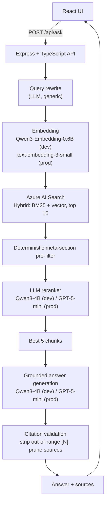
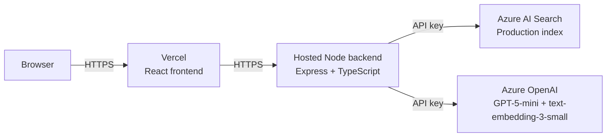

# Portfolio RAG Assistant

A retrieval-augmented chat assistant that answers questions about my
work — projects, employers, technologies, and individual contributions —
grounded strictly in a curated knowledge base of my resume and project
write-ups.

Built end-to-end: knowledge ingestion, hybrid retrieval on Azure AI
Search, LLM reranking, grounded answer generation, citation validation,
a hardened Express API, and a React frontend. The same TypeScript
codebase runs locally against free Ollama models during development and
against Azure OpenAI in production, selected by a single environment
variable.

---

## Table of contents

- [What this project does](#what-this-project-does)
- [Why RAG instead of a generic chatbot](#why-rag-instead-of-a-generic-chatbot)
- [Architecture](#architecture)
- [Retrieval pipeline](#retrieval-pipeline)
  - [Query rewriting](#query-rewriting)
  - [Hybrid BM25 + vector retrieval](#hybrid-bm25--vector-retrieval)
  - [Reranking](#reranking)
  - [Unsupported-question rejection](#unsupported-question-rejection)
  - [Citation validation](#citation-validation)
- [Provider abstraction: Ollama dev / Azure prod](#provider-abstraction-ollama-dev--azure-prod)
- [React + Express architecture](#react--express-architecture)
- [Security and API protections](#security-and-api-protections)
- [Knowledge ingestion](#knowledge-ingestion)
- [Local setup](#local-setup)
- [Environment variables](#environment-variables)
- [Testing](#testing)
- [30-question regression evaluation](#30-question-regression-evaluation)
- [Deployment architecture](#deployment-architecture)
- [Limitations](#limitations)
- [Future improvements](#future-improvements)

---

## What this project does

Given a natural-language question about my career — for example
*"What did Zohaib do at PHSA?"* or *"What technologies power JobTrackr?"*
— the assistant:

1. Searches a curated Markdown knowledge base (resume + project pages).
2. Retrieves the most relevant passages using hybrid search on Azure AI
   Search.
3. Reranks the candidates with an LLM so the strongest evidence rises
   to the top.
4. Generates a grounded, citation-labelled answer.
5. Returns both the answer and the specific source cards the answer
   actually references.

When the knowledge base does not contain the answer, the assistant says
so plainly rather than inventing content.

---

## Why RAG instead of a generic chatbot

A general-purpose LLM does not know my resume, has no way to cite
specific evidence, and will confidently fabricate details when asked
about me. That is the wrong shape for a portfolio assistant, where
truthfulness and attribution are the entire point.

RAG solves both problems:

- **Truthfulness.** Answers are generated from retrieved passages the
  model can be constrained to. Unsupported questions short-circuit to a
  canonical "not enough information" response.
- **Attribution.** Every claim can be traced to a `[N]` citation that
  maps to a source card in the UI. The backend prunes those citations
  after generation so the UI never shows a source that wasn't actually
  used.

The additional benefit is that updating my portfolio content is a
Markdown edit — no model retraining, no fine-tuning.

---

## Architecture



---

## Retrieval pipeline

The pipeline lives in `backend/src/services/retrievalService.ts` and
coordinates five stages. Rationale and benchmarks for each are in
[`docs/design-decisions.md`](docs/design-decisions.md).

### Query rewriting

An LLM rewrites the natural-language question into a concise,
search-oriented query. The rewrite is **generic** — no hard-coded
question table, no per-project rules — so the pipeline handles arbitrary
new questions without code changes.

Example rewrites:

| Question | Rewrite |
|---|---|
| *"What's Zohaib's current job?"* | `current employment position role` |
| *"What was his jailbreak contribution?"* | `LLM jailbreak detection individual contribution` |

The rewrite step is gated by a `QUERY_REWRITE_ENABLED` env flag so it
can be A/B compared against the raw-question baseline without touching
code.

### Hybrid BM25 + vector retrieval

Azure AI Search runs a single hybrid query combining BM25 keyword
scoring with HNSW cosine similarity against the embedded query vector.
This retrieves a **broad candidate pool of 15** — deliberately
recall-heavy, since Azure's own top-5 ordering is only moderately
precise.

The embedding is computed from the **original** question, not the
rewrite, so the vector side preserves full context that the keyword
rewrite may compress away.

A dimension guard throws if the embedding vector doesn't match the
index's expected dimensionality (1024 for the Ollama-dev index, 1536
for the Azure production index). This prevents the classic RAG bug of
querying an index with vectors from the wrong model.

### The Projects Catalogue chunk

The Search index contains one auto-generated **Projects Catalogue**
document alongside the normal source chunks. It's a compact index —
category headings from `resume.md` (Machine Learning / AI / Data
Science, Analytics & BI, Full-Stack, Database, Digital Transformation,
Networking & Security) plus every project's canonical name pulled from
that section's H3 headings. ~150 words, ~260 tokens.

The catalogue is stored with `source: "catalogue"`, `sourceType:
"catalogue"`, `section: "Projects Catalogue"`, `id: "catalogue-0"`.
It's retrieved through the same hybrid + rerank path as everything
else — no runtime intent detection, no special-case widening. Broad
enumeration queries ("what projects has X done", "list X's data
projects") match the catalogue naturally and get a compact document
the answer LLM can enumerate from cleanly.

Details, alternatives considered, and the A/B/C evaluation that
justified this shape live in
[`docs/design-decisions.md`](docs/design-decisions.md).

### Reranking

The 15 candidates first pass through a deterministic regex blocklist
that drops meta-section chunks (`License`, `Contact`, project structure,
etc.) unless the user's question is explicitly about the portfolio site
itself. This typically removes ~5 candidates before the LLM sees them.

The surviving ~10 candidates go to an LLM reranker that returns a
**selection-only** JSON array of the relevant chunk numbers, in ranked
order. Only chunks the model deems relevant appear in the array; an
empty array means nothing in the pool answers the question.

Candidate bodies are truncated to 150 words for the rerank prompt only
— the full text still flows to the answer generator. Combined with the
pre-filter, this cut the rerank prompt by roughly 78% versus a naive
implementation that sent all 20 full-length candidates.

The reranker keeps the top 5 chunks as the final grounding context.

**Typo tolerance.** The rerank instructions include a generic clause
telling the model to treat obvious minor spelling variations as
referring to the correctly-spelled entity when the surrounding evidence
is clear ("Roshtai" → Roshtay, "PHAS" → PHSA). No project or employer
names are hardcoded — the instruction is shape-based. On Azure, this
pairs with `reasoning.effort: "low"` on the rerank call (up from
`minimal`) which is what actually enables the model to apply the
instruction reliably.

### Unsupported-question rejection

When the reranker returns an empty array, `ragService` short-circuits
to a canonical response — *"The portfolio does not contain enough
information to answer that."* — without calling the answer model.

There is deliberately no RRF-score threshold. Hybrid RRF scores do not
behave like calibrated probabilities, so treating them as
`score >= 0.75` gave misleading rejections. The reranker's explicit
selection is the relevance signal instead.

### Citation validation

The answer LLM is asked to produce `[N]` citations against the numbered
context. After generation, `citationService`:

1. Strips any `[N]` where `N` falls outside the range of chunks actually
   sent to the model (including preceding whitespace so sentences read
   cleanly).
2. Prunes the `sources` array to only citations that survive in the
   sanitized text.

The API contract is that `sources` contains exactly what the answer
references — no more, no less — so the frontend can render source cards
without any client-side citation parsing.

---

## Provider abstraction: Ollama dev / Azure prod

Every LLM-touching service routes on a single `AI_PROVIDER`
environment variable. **No TypeScript changes** are required to swap
environments.

### Development configuration

Runs entirely locally against free open models:

- Chat / query rewrite / rerank: **Qwen3 4B Instruct** (via Ollama)
- Embeddings: **Qwen3 Embedding 0.6B** → 1024 dimensions
- Search index: `portfolio-chunks-dev-ollama` (Azure AI Search Free tier)

### Production configuration

- Chat / query rewrite / rerank: **GPT-5-mini** (Azure OpenAI)
- Embeddings: **text-embedding-3-small** → 1536 dimensions
- Search index: `portfolio-chunks` (same Azure Search service)

Per-stage `reasoning.effort` is tuned to the smallest value that
produces correct output — `minimal` for query rewrite, `low` for
rerank and answer generation — to minimise Azure token spend. See
`docs/design-decisions.md` for the Roshtai 5x diagnostic that
justified the rerank effort bump.

Switching environments is a single `.env` edit:

```env
# Development
AI_PROVIDER=ollama
AZURE_SEARCH_INDEX_NAME=portfolio-chunks-dev-ollama

# Production
AI_PROVIDER=azure
AZURE_SEARCH_INDEX_NAME=portfolio-chunks
```

The dimension guard mentioned above catches any mismatch between the
active embedding model and the target index.

---

## React + Express architecture

**Frontend** — `frontend/`

- React 19 + Vite + TypeScript.
- Single-page chat UI: streaming-style loading indicator, suggested
  starter questions, Markdown answer rendering, per-message source
  cards.
- Auto-scrolls to the newest message; input disabled while a request
  is in flight; Enter submits.
- Answers are rendered with `react-markdown`; external links open with
  `rel="noopener noreferrer"` in a new tab.
- No client-side citation logic — the backend guarantees `sources` is
  already pruned.

**Backend** — `backend/`

- Express 5 + TypeScript on Node 20 (ESM end-to-end).
- Single public endpoint: `POST /api/ask` with `{ question: string }`.
- Health endpoint: `GET /api/health` (unauthenticated, no provider
  info leaked).
- Runs on Ollama during development via `tsx watch`, on Azure OpenAI
  in production via `tsx`.

---

## Security and API protections

Implemented in `backend/src/index.ts`:

| Protection | Detail |
|---|---|
| Helmet | Standard HTTP security headers; `X-Powered-By` explicitly disabled |
| CORS | Restricted to `ALLOWED_ORIGIN` (localhost during dev, Vercel domain in prod) |
| Body size | `express.json({ limit: "10kb" })` |
| Question length | Trimmed and capped at 500 characters |
| Rate limit | 20 requests per IP per minute on `/api/ask` only |
| Input validation | String check → non-empty → length cap, before the RAG pipeline runs |
| Error handling | Centralized 500 handler; never leaks stack traces, provider names, model names, endpoint URLs, or Azure error bodies |
| Malformed JSON | Body-parser errors translated to 400 "Invalid JSON body." |
| Oversize body | Translated to 413 "Request body too large." |
| Health probe | Not rate-limited; returns only `{ "status": "ok" }` |

---

## Knowledge ingestion

Source content lives in `knowledge/` as hand-written Markdown files —
one per project or document (`resume.md`, `roshtay.md`,
`jobtrackr.md`, `enterprise-llm-jailbreak-detection.md`,
`security-log-analyzer.md`, `portfolio-website.md`).

`backend/src/scripts/ingestKnowledge.ts`:

1. Loads and normalises each Markdown file.
2. Chunks each document into ~350-word passages with 50-word overlap,
   preserving section headings.
3. Generates an auto-derived **Projects Catalogue** chunk from
   `resume.md`'s H2/H3 structure (see the retrieval-pipeline section
   above). One compact chunk, deterministic id `catalogue-0`.
4. Deletes any existing documents where `sourceType eq 'catalogue'`
   in the target index so re-ingestion is a full replace for the
   catalogue — shape or id changes can't leave orphan documents.
5. Generates an embedding per chunk with the active provider.
6. Uploads the chunk + embedding + metadata (`source`, `sourceType`,
   `section`, `chunkIndex`) to the Azure AI Search index.

Re-running the script is idempotent; updated knowledge is picked up on
the next ingestion pass. Because catalogue freshness now depends on
ingestion, adding a new project to `resume.md` requires re-running
`npm run ingest` before the broad enumeration answers reflect it.

### Staging index bootstrap

For safe experimentation, `npm run bootstrap:staging` clones the
production Search index schema into `portfolio-chunks-staging`. It's
idempotent — no-op if the target already exists — and never modifies
the source index. Useful before any change that would reshape the
catalogue or the ingestion pipeline.

---

## Local setup

Requirements:

- Node.js 20+
- Ollama running locally with the two Qwen models pulled
- An Azure AI Search service (Free tier is sufficient) with a
  development index provisioned

```bash
# Clone
git clone https://github.com/ZohaibRahim/portfolio-RAG-project.git
cd portfolio-RAG-project

# Backend
cd backend
npm install
cp ../.env.example ../.env       # then fill in Azure Search keys
npm run ingest                   # one-time: uploads chunks + embeddings
npm run dev                      # http://localhost:3000

# Frontend (in a second terminal)
cd frontend
npm install
npm run dev                      # http://localhost:5173
```

Pull the Ollama models first:

```bash
ollama pull qwen3:4b-instruct
ollama pull qwen3-embedding:0.6b
```

---

## Environment variables

`.env.example` in the repo root documents every variable with safe
placeholders. The important ones:

| Variable | Purpose |
|---|---|
| `AI_PROVIDER` | `ollama` (dev) or `azure` (prod) |
| `QUERY_REWRITE_ENABLED` | `true` / `false` — bypass the rewrite stage for A/B testing |
| `AZURE_SEARCH_ENDPOINT` | Azure AI Search service URL |
| `AZURE_SEARCH_API_KEY` | Admin key for the Search service |
| `AZURE_SEARCH_INDEX_NAME` | Dev or production index name |
| `AZURE_OPENAI_ENDPOINT` | Production only |
| `AZURE_OPENAI_API_KEY` | Production only |
| `AZURE_OPENAI_CHAT_DEPLOYMENT` | GPT-5-mini deployment name |
| `AZURE_OPENAI_EMBEDDING_DEPLOYMENT` | text-embedding-3-small deployment name |
| `OLLAMA_BASE_URL` | Dev only, defaults to `http://localhost:11434` |
| `OLLAMA_CHAT_MODEL` | e.g. `qwen3:4b-instruct` |
| `OLLAMA_EMBEDDING_MODEL` | e.g. `qwen3-embedding:0.6b` |
| `PORT` | Backend port (default `3000`) |
| `ALLOWED_ORIGIN` | Frontend origin allowed by CORS |

`.env` is git-ignored; never commit real keys.

---

## Testing

Backend scripts under `backend/package.json`:

| Command | What it does |
|---|---|
| `npm run test:citations` | Unit-style checks for citation validation (five cases, no network) |
| `npm run test:retrieval` | Ad-hoc retrieval spike against the live search index |
| `npm run test:rag` | End-to-end pipeline against a small question set |
| `npm run test:regression` | The 30-question regression suite (see below) |

Frontend:

```bash
cd frontend
npm run lint     # ESLint
npm run build    # tsc -b && vite build (also verifies TypeScript)
```

---

## 30-question regression evaluation

`npm run test:regression` runs a fixed 30-question suite that covers
identity, employers, projects, technologies, individual-vs-team
attribution, typos, and unsupported questions. Each question has a
hard-pass gate — either specific evidence must appear in the top-5, or
the assistant must correctly reject the question.

Current state: **30 / 30 hard passes** with the pipeline as documented,
including at pool sizes down to 12. See `docs/design-decisions.md` for
the pool-size sweep and the reranker contract evolution.

The regression suite is intentionally **not** wired into CI — running
it requires either a local Ollama or Azure credentials, which would
make every push either brittle or expensive. It runs locally before
each release.

---

## Deployment architecture

Planned production topology:



Secrets are set in the hosting environment; `.env` is never committed.

Continuous integration runs on every push and pull request via GitHub
Actions (`.github/workflows/ci.yml`) — backend typecheck plus frontend
lint and build.

---

## Limitations

- **Single-turn only.** V1 treats every question independently; there
  is no conversation memory, so *"what technologies did he use there?"*
  after a PHSA question does not resolve.
- **Small knowledge base.** Answers are as good as the curated Markdown
  files. If a fact isn't written down, the assistant will honestly say
  it doesn't know.
- **English only.** The retrieval pipeline and prompts are English-only;
  no multilingual evaluation has been done.
- **In-memory rate limit.** Single-instance only. Scaling horizontally
  would require a shared store.
- **No daily spend ceiling yet.** Per-IP rate limits are in place, but
  a global daily cap on Azure token spend is still on the roadmap
  before wider public exposure.

---

## Future improvements

- **V2 conversation memory** — send a bounded history window, or
  rewrite follow-ups into standalone retrieval queries.
- **Structured evaluation dashboard** — per-category pass rates
  (identity / employers / typos / unsupported / …) rather than a flat
  pass count.
- **Larger knowledge base** — additional project write-ups and
  potentially blog posts.
- **Global daily spend ceiling** — hard cutoff to protect against
  viral-moment cost spikes.
- **Streaming answers** — token-by-token rendering for perceived
  latency wins.
- **Structured JSON answers** — for questions with a clean tabular
  shape (technologies, dates, metrics), render as tables in the UI.
